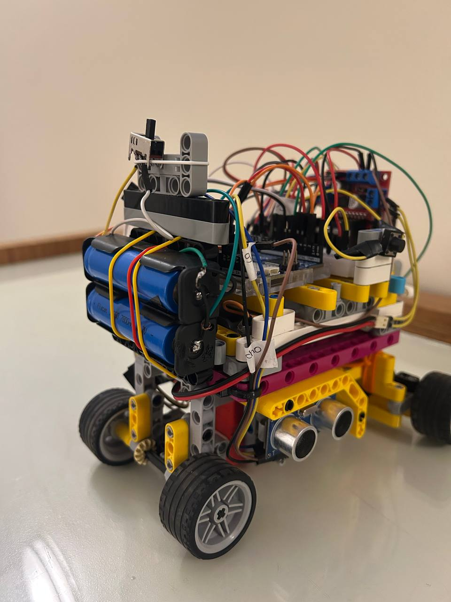
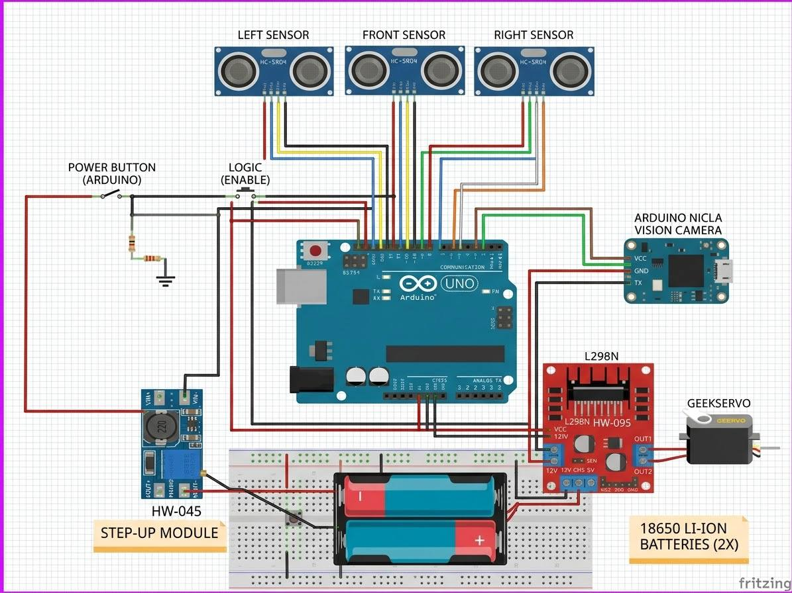
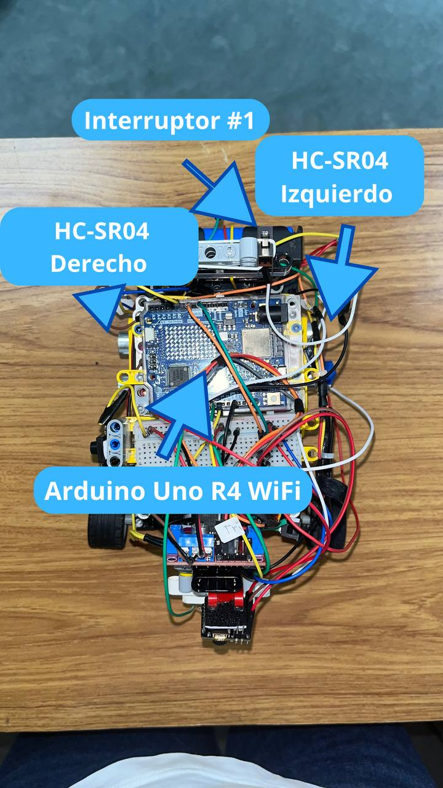
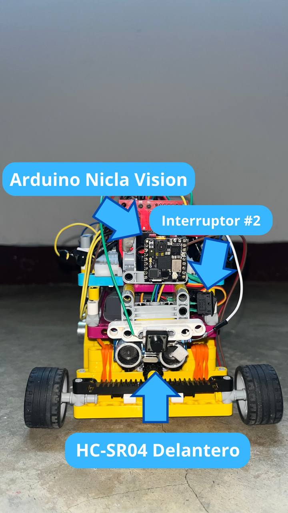
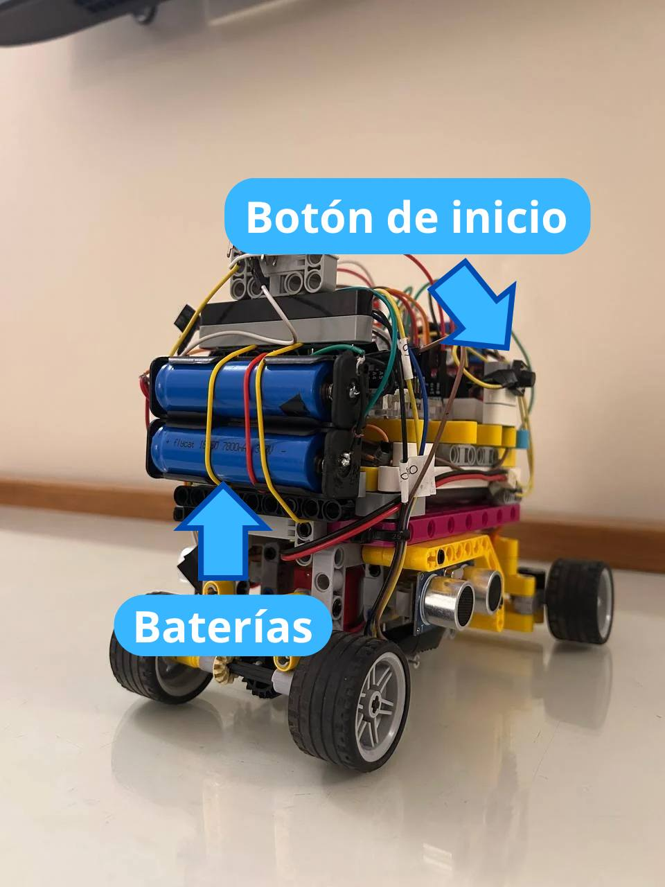

# Documentación de Ingeniería - Team Eule Tech


## Introducción
En el presente repositorio podrán encontrar toda la construcción y ensamblaje del Robot Autónomo construido por el *Team Eule Tech* para la categoría Future Engineers en la temporada 2026 de la *World Robot Olympiad (WRO)*. Este proyecto se materializó tras meses de arduo trabajo y experiencias inolvidables, representando nuestra pasión por la robótica y por alcanzar nuestros más grandes sueños.
> _"Was immer du tun kannst oder träumst es zu können, fang damit an. Kühnheit hat Genie, Macht und Magie in sich." - Johann Wolfgang von Goethe_


## Contenido
- [Integrantes del Team](https://github.com/colegioalemanwro2026/wro-futureengineers/blob/main/README.md#integrantes-del-equipo)
- [Diseño de Hardware](https://github.com/colegioalemanwro2026/wro-futureengineers#diseño-de-hardware)
 - [Proceso de Diseño](https://github.com/colegioalemanwro2026/wro-futureengineers#proceso-de-diseño)
 - [Proceso de Ensamblaje](https://github.com/colegioalemanwro2026/wro-futureengineers/blob/main/README.md#proceso-de-ensamblaje)
 - [Elementos](https://github.com/colegioalemanwro2026/wro-futureengineers/blob/main/README.md#elementos)
   - [Piezas Estructurales (Kits)](https://github.com/colegioalemanwro2026/wro-futureengineers/blob/main/README.md#piezas-estructurales-kits)
   - [Electrónica](https://github.com/colegioalemanwro2026/wro-futureengineers/blob/main/README.md#electr%C3%B3nica)
- [Diseño del Software](https://github.com/colegioalemanwro2026/wro-futureengineers#dise%C3%B1o-del-software)
 - [Arquitectura del Sistema](https://github.com/colegioalemanwro2026/wro-futureengineers#arquitectura-del-sistema)
 - [Adquisición de Datos de los Sensores](https://github.com/colegioalemanwro2026/wro-futureengineers#adquisici%C3%B3n-de-datos-de-los-sensores)
   - [Medición de Distancia con Sensores Ultrasónicos](https://github.com/colegioalemanwro2026/wro-futureengineers#medici%C3%B3n-de-distancia-con-sensores-ultras%C3%B3nicos)
 - [Comunicación con la IMU y Módulos Externos](https://github.com/colegioalemanwro2026/wro-futureengineers#comunicaci%C3%B3n-con-la-imu-y-m%C3%B3dulos-externos)
 - [Estimación de Estado mediante un Filtro de Kalman](https://github.com/colegioalemanwro2026/wro-futureengineers#estimaci%C3%B3n-de-estado-mediante-un-filtro-de-kalman)
 - [Control del Robot](https://github.com/colegioalemanwro2026/wro-futureengineers#control-del-robot)
   - [Controlador LQR para la Dirección](https://github.com/colegioalemanwro2026/wro-futureengineers#controlador-lqr-para-la-direcci%C3%B3n)
 - [Control de la Misión](https://github.com/colegioalemanwro2026/wro-futureengineers#control-de-la-misi%C3%B3n)
   - [Máquina de Estados Finitos](https://github.com/colegioalemanwro2026/wro-futureengineers#m%C3%A1quina-de-estados-finitos)
 - [Control del Motor y la Dirección](https://github.com/colegioalemanwro2026/wro-futureengineers#control-del-motor-y-la-direcci%C3%B3n)
   - [Control del Motor](https://github.com/colegioalemanwro2026/wro-futureengineers#control-del-motor)
   - [Control del Servo de Dirección](https://github.com/colegioalemanwro2026/wro-futureengineers#control-del-servo-de-direcci%C3%B3n)
 - [Telemetría y Depuración](https://github.com/colegioalemanwro2026/wro-futureengineers#telemetr%C3%ADa-y-depuraci%C3%B3n)
 - [Impacto](https://github.com/colegioalemanwro2026/wro-futureengineers#impacto)
 - [Nuestro Recorrido](https://github.com/colegioalemanwro2026/wro-futureengineers#nuestro-recorrido)

---
# *Integrantes del Equipo*

- Isaac Camargo (Programador)

> Guten Tag! Soy Isaac Camargo, tengo 16 años y junto a mi compañera Fer estoy muy feliz de poder participar en esta competencia. Todo nuestro trayevto ha sido pura diversión y aprendizaje y estoy seguro de que gracias a esto, daremos lo mejor de nosotros en cada encuentro de la WRO. Bis bald!


- Fernanda León (Mecánica)
)
> Hallo! Soy Fernanda León, tengo 17 años y me emociona tener la oportunidad de participar junto a Isaac en esta competencia. Nuestro esfuerzo durante tanto tiempo finalmente valdrá la pena y daremos lo mejor de nosotros en todo momento. Tschüssi!

---
# *Diseño de Hardware*
## *Proceso de Diseño*

Nuestro robot está construido en el chasis principalmente a partir de una combinación de piezas del **LEGO SPIKE Prime Set** y el **Nezha 48 in 1 Inventor's Kit**, incluyendo el motor de tracción, ruedas, servomotor de dirección y estructura. La alimentación proviene de una **batería VEX IQ Education Kit (2ª generación)** y unas **baterías de Iones de Litio (Li-Ion) 18650** con electrónica personalizada que habilita la funcionalidad autónoma completa.

Nuestro robot pasó por múltiples revisiones estructurales y electrónicas antes de alcanzar su forma final y lista para competencia, las cuales están divididas en 4 versiones:

### Versión 1:
El plan original se basó en construir el robot completamente con el Kit de Inventor Nezha (chasis, ruedas, motor de tracción y servomotor de dirección) gracias a la facilidad de construcción de sus piezas. Usamos una Micro:bit junto con una Placa de Expansión Nezha como controlador principal, sensores Nezha para detectar el entorno y una cámara Arduino Nicla Vision para visión artificial. Elegimos esta cámara sobre la de Nezha debido a su reconocimiento de objetos preciso y eficiente.


### Versión 2:
Enfrentamos dificultades significativas de cableado al intentar conectar la Micro:bit → Placa de Expansión Nezha → Nicla Vision debido a la diferencia de puertos RJ45 y Micro USB respectivamente. Para resolverlo, reemplazamos la mayoría de la electrónica Nezha por un Microcontrolador ESP32, un Controlador TB6612FNG (HW-166) (Puente H Dual) y Sensores ultrasónicos HC-SR04. Esto simplificó la conexión con la Nicla Vision, pero nos dimos cuenta de que el controlador principal necesitaba una entrada de 5V constantes y mayor rango de voltaje, con los cuales el ESP32 y el Puente H Dual no contaban.


### Versión 3:
Para lograr una conexión cableada estable entre el sistema de visión y el cerebro del robot, migramos en un principio al Arduino Uno. Aunque cumplía con los 5V necesarios, elegimos finalmente el Arduino Uno R4 WiFi como el controlador principal fijo, el cual tiene mayor rango de voltaje, es totalmente compatible con la Nicla Vision y va de la mano en potencia con un Controlador L298N (HW-095) (Puente H Dual Robusto) y demás electrónica de soporte estandarizada para Arduino. Esto eliminó cualquier complicación por falta de voltaje, asegurando la captura correcta de imágenes en la cámara y mayor seguridad en el circuito.


### Versión 4:
En último lugar, con la finalidad de perfeccionar la comunicación y evitar problemas como el reinicio de los componentes al no distribuirse correctamente la energía cuando los motores exigían mucha fuerza, se incluyeron en el circuito unas Baterías de Litio 18650 recargables con su respectivo Módulo de Carga de Baterías de Litio (TP4056 / HW-373) y un Módulo Elevador de Voltaje StepUp HW-045 (MT3608). Esto estabilizó la comunicación entre componentes y eliminó cualquier problema de bajas de voltaje a futuro. Cada modificación se realizó con un resultado único y compacto en mente, llegando así al diseño final que se presenta en la competencia.



## Proceso de Ensamblaje

El ensamblaje del robot se llevó a cabo de manera modular y progresiva, construyendo desde la base (chasis y tren de tracción) hacia la superficie (electrónica de control y visión) siguiendo una metodología de análisis y gestión "bottom-up", la cual al consistir en empezar partiendo del proceso o sistema más pequeño hasta el más trabajado, permitió validar cada etapa antes de integrar la siguiente.

El primer paso consistió en la construcción del módulo inferior. Partimos de referencias de vehículos autónomos de evasión de obstáculos, tomando como base principal el [**Case 26 — The Obstacle Avoidance Car 2**](https://wiki.elecfreaks.com/en/microbit/building-blocks/nezha-inventors-kit-v2/the-smart-obstacle-avoidance-car-2/) del Kit Nezha, el cual adaptamos y modificamos para cumplir con los requisitos de la competencia. Este módulo integra el chasis principal construido con piezas de LEGO SPIKE Prime y Nezha, el motor de tracción trasera, el servomotor de dirección, las ruedas con su sistema de transmisión, los sensores y la batería VEX IQ Education Kit de segunda generación montada sobre un soporte de LEGO, elegida debido a la capacidad de Voltaje tan fuerte y beneficiaria que posee, que va de 7.4 V a 2000 mA.

Una vez definida la arquitectura electrónica final (tras la migración desde Micro:bit/Nezha hacia Arduino Uno R4 WiFi y Controlador L298N) se diseñó un nivel superior dedicado para alojar toda la electrónica sobre el soporte de batería ya existente. En este módulo intermedio se aplicaron tres criterios fundamentales: una gestión de cableado ordenada, separación física entre fuentes de potencia (motores) y señal (sensores, comunicación) para minimizar interferencias electromagnéticas; accesibilidad total a conectores USB-C de Arduino y MicroUSB Nicla para la configuración de códigos en la práctica.

En tercer lugar, se fabricó un soporte dedicado para la Nicla Vision hecho de piezas LEGO del mismo Kit, que mantiene la cámara en el ángulo óptico preciso de 10° respecto a la horizontal (validado mediante pruebas de campo); garantiza estabilidad dinámica entre el soporte y el chasis; y protege las conexiones hacia el Arduino, evitando tensiones en el puerto durante la manipulación y el encendido del robot.

Y luego, al añadir las baterías de Litio para mayor estabilidad de comunicación, se pegaron a una estructura hecha de LEGO en la cara trasera del robot, en paralelo, con el fin de generar mayor potencia a la Cámara Nicla y al Arduino, y no ocupar espacio que es necesario para las conexiones. Así como el módulo elevador de voltaje,

La unificación de los módulos se logró mediante ejes pasadores (Axle pins) LEGO Technic/Nezha junto con cinta 3M VHB 5952 (1,1 mm) para la fijación de PCBs, reguladores y módulos sin orificios de tornillo, resistente a vibración, ciclos térmicos y manipulación repetida. Este enfoque modular permitió modificar independientemente en cada nivel, lo que permitió realizar los cambios antes mencionados, y el cual puede representarse en el siguiente esquema:



# Elementos

## Piezas Estructurales (Kits)

> **Nota:** Todas las piezas estructurales provienen de los kits indicados; no se fabricaron piezas personalizadas mediante impresión 3D.


### LEGO SPIKE Prime Set (45678)
- **Referencia:** LEGO Education SPIKE™ Prime Set — Set 45678
- **Año de lanzamiento:** 2020 | **Piezas:** 528 (oficial) / 532 (inventario real)
- **Componentes electrónicos incluidos en el kit:**
  -- **Hub programable (Large Hub)** — 6 puertos I/O, matriz LED 5×5, giroscopio de 6 ejes, altavoz, Bluetooth, batería recargable integrada
  - **Motores:** 1 × Large Angular Motor + 2 × Medium Angular Motors (con encoder absoluto, control de posición/velocidad)
  - **Sensores:** Distance Sensor (ultrasónico), Force Sensor, Color Sensor
  - **Conectividad:** Bluetooth LE, USB-C (en Hub), cables inteligentes
- **Elementos estructurales:** +500 piezas LEGO Technic™ (vigas, ángulos, ejes, pasadores, engranajes, ruedas, neumáticos, plates, frames) en paleta de colores fresca
- **Almacenamiento:** Caja resistente con bandejas de clasificación
- **Uso en el robot: Chasis principal, estructura de soporte de batería, ejes pasadores para unión de módulos**


### Nezha 48 in 1 Inventor's Kit (ELECFREAKS micro:bit)
- **Referencia:** ELECFREAKS micro:bit Nezha 48 IN 1 Inventor's Kit (sin micro:bit)
- **Componentes electrónicos incluidos:**
  - **Nezha Expansion Board** — Placa base FR4 epoxy 94VO, batería Li-Ion 900 mAh integrada, puertos RJ11 con código de color (IIC, UART, SPI), entrada 5 V, carga 1 A
  - **Sensores/módulos (Planet X):** LED rojo/verde/amarillo, sensor de impacto, sensor de seguimiento de línea, sensor ultrasónico, potenciómetro, sensor de humedad de suelo, bocina, etc. (hasta 40+ sensores soportados)
  - **Actuadores:** Motor DC Nezha, Servomotor Nezha
  - **Construcción:** +400 piezas de bloques compatibles LEGO/Fischer, ruedas, engranajes, ejes
  - **Programación:** MakeCode, JavaScript, Python, C++
- **Especificaciones de la Expansion Board:** 60×82×28 mm, carcasa ABS, protocolos IIC/UART/SPI
- **Uso en el robot (versión inicial): Chasis base (Case 26 Obstacle Avoidance Car),  Expansion Board para micro:bit, sensores Nezha. **En versión final:** Solo se conservan piezas estructurales (vigas, brackets, ruedas, engranajes) y electrónicas del kit (motor DC y servomotor); toda la electrónica Nezha fue reemplazada.**


### VEX IQ Education Kit (2ª Generación) — Solo Batería
- **Referencia:** VEX IQ Robot Battery (Li-Ion, 2000 mAh) — Part 228-7045
- **Especificaciones:**
  - **Química:** Li-Ion (iones de litio) — 5× mayor retención de voltaje vs NiMH
  - **Voltaje nominal:** 7.2 V (7.4 V pico)
  - **Capacidad:** 2000 mAh
  - **Corriente máxima continua:** 8 A (limitada por temperatura)
  - **Carga:** Puerto USB-C integrado, tiempo ~2 horas
  - **Indicador:** 4 LEDs verdes (barra de carga) + botón de estado
  - **Dimensiones/peso:** ~0.23 kg
  - **Compatibilidad:** Funciona con IQ Robot Brain 1ª y 2ª gen
- **Uso en el robot: Fuente de energía principal para motores (vía L298N) e interruptor (5 V para lógica)**


### Baterías de Iones de Litio (Li-Ion) 18650 — Flycat 3.7 V (2 Unidades en el Sistema)
- **Formato / Tamaño**: 18650 (Cilíndrica, 18 mm de diámetro/65 mm de longitud)
- **Química**: Iones de Litio (Li-Ion)
- **Voltaje nominal**: 3.7 V por celda (7.4 V nominal total en configuración en serie / 3.7 V en paralelo)
- **Voltaje de carga máxima**: 4.2 V por celda
- **Voltaje de corte por descarga**: 2.75 V - 3.0 V por celda (mínimo seguro)
- **Capacidad nominal declarada**: Marca Flycat 7800 mAh (Capacidad comercial/etiqueta)
- **Corriente máxima de descarga**: 1 C – 2 C en descarga continua habitual para celdas estándar de robótica
- **Vida útil**: 500 ciclos de carga/descarga completa
- **Polaridad**: Terminal positivo plano/convexo (+) y terminal negativo plano (-)
- **Peso aprox.**: 45 g por celda
- **Función en el robot: Fuente principal de almacenamiento de energía recargable del robot. Proveen la corriente requerida por el driver de motores L298N (potencia) y el módulo elevador MT3608 (lógica) para garantizar total autonomía.**

## Electrónica

### Control Principal


**Arduino Uno R4 WiFi (ABX00087)**
- **MCU principal:** Renesas RA4M1 (R7FA4M1AB3CFM) — Arm Cortex-M4 @ 48 MHz con FPU
- **Coprocesador inalámbrico:** ESP32-S3-MINI-1-N8 — Xtensa dual-core LX7, Wi-Fi 4 (2.4 GHz), Bluetooth 5 LE
- **Memoria (RA4M1):** 256 KB Flash / 32 KB SRAM / 8 KB EEPROM
- **Memoria (ESP32-S3):** 384 KB ROM / 512 KB SRAM
- **Voltaje de operación:** 5 V (RA4M1) / 3.3 V (ESP32-S3) — traductor de nivel TXB0108 interno
- **USB:** USB-C (hasta 21 V PD input, HID support)
- **I/O:** 14 pines digitales, 6 entradas analógicas (14-bit ADC), 6 PWM, 1 DAC (12-bit), CAN Bus, I2C (Qwiic), SPI, UART
- **Extras:** Matriz LED 12×8, RTC, VRTC pin (batería backup), pin OFF
- **Función en el robot: Controlador principal — fusión de sensores, control PWM de motores (L298N), comunicación serie UART con Nicla Vision @ 115200 baudios, bucle de control 50 Hz**

### Visión Artificial


**Arduino Nicla Vision (ABX00051)**
- **MCU:** STM32H747AII6 — Dual core: Cortex-M7 @ 480 MHz + Cortex-M4 @ 240 MHz
- **Cámara:** GC2145 / OV5640 — 2 MP color, 30 FPS @ resolución completa, soporte TinyML
- **Sensores integrados:** LSM6DSOX (IMU 6-ejes), MP34DT05 (micrófono MEMS), VL53L1CBV0FY (ToF distancia)
- **Conectividad:** Murata 1DX (CYW4343W) — Wi-Fi / BLE 4.2, USB-C (high-speed 500 Mbps)
- **Memoria:** 2 MB Flash / 1 MB RAM + 16 MB QSPI Flash
- **Seguridad:** NXP SE050C2 Crypto chip
- **Alimentación:** 3.7 V Li-Po (cargador MAX17262 integrado) o MicroUSB 5 V
- **Dimensiones:** 22.86 × 22.86 mm | **Temp. operación:** -20 °C a +70 °C
- **Interfaces:** I2C (conector ESLOV), SPI, UART, GPIO, ADC, JTAG, castellated pins
- **Función en el robot: Detección de pista en tiempo real (conos rojos/verdes), clasificación, envío de datos de posición/orientación vía UART serie directo a Arduino Uno R4 WiFi. Cableado MicroUSB protegido, ángulo fijo 10°.**

### Control de Motores


**L298N Dual H-Bridge Motor Driver (HW-095 / MDU-1049)**
- **Chip:** STMicroelectronics L298N (Monolithic IC, Multiwatt15 / PowerSO-20)
- **Topología:** Puente H dual (2 canales independientes)
- **Voltaje motor (VCC):** 5–35 V (máx. 46 V chip)
- **Voltaje lógica:** 5 V (4.5–7 V)
- **Corriente continua:** 2 A por canal
- **Corriente pico:** 3–4 A (no repetitivo, con disipador adecuado)
- **Potencia máxima:** 25 W
- **Protecciones:** Térmica (apagado ~130 °C), sobrecorriente, diodos de flyback internos
- **Regulador 5 V integrado:** 78M05 (activo con jumper si VCC ≤ 12 V; provee 5 V @ 1 A para lógica/MCU)
- **Pines de control:** IN1–IN4 (dirección), ENA/ENB (PWM velocidad)
- **Dimensiones módulo:** 43×43×27 mm | **Peso:** ~25–33 g
- **Función en el robot: Acciona motor DC de tracción (canal A) y servomotor de dirección (canal B) desde PWM del Arduino. Alimentado desde batería VEX 7.4 V.**

### Sensores


**HC-SR04 Ultrasonic Distance Sensor**
- **Principio:** Sonar ultrasónico 40 kHz (time-of-flight)
- **Rango teórico:** 2 cm – 400 cm (práctico: 2–80 cm óptimo)
- **Precisión:** ±3 mm
- **Ángulo de haz:** <15° (cono efectivo ~30°)
- **Voltaje:** 5 V DC (4.5–5.5 V)
- **Corriente:** <15 mA activa, <2 mA reposo
- **Pines:** VCC, Trig (input, pulso 10 µs), Echo (output, pulso ancho = tiempo vuelo), GND
- **Dimensiones:** 45×20×15 mm | **Peso:** 9 g
- **Función en el robot: Detección frontal de paredes/obstáculos, montado en parachoques con ángulo fijo.**

### Conversión y Distribución de Potencia


**Protoboard / Protoboard compacta** (placa de pruebas de 400/830 puntos o PCB perforada)
- **Uso en el robot: Distribución de líneas de potencia (5 V, 7.4 V, GND), conexiones de señales PWM, I2C, UART, capacitores de desacoplo (100 µF electrolítico + 0.1 µF cerámico por rail)**


**Capacitor Electrolítico de Aluminio | 100 µF / 25 V (105 °C, Low ESR)**
- **Capacitancia nominal**: 100 µF (±20 % estándar)
- **Voltaje nominal**: 25 V (mínimo 16 V; 25 V recomendado para rails de 5 V y 7.4 V con margen 2×)
- **Tipo**: Radial through-hole, diámetro 6.3–8 mm × altura 11–12 mm, paso 2.5–3.5 mm
- **ESR**: 0.3–0.8 Ω a 100 kHz, 25 °C (series Low ESR: FC, FM, YXF, UPW)
- **Corriente de rizado**: 200–400 mA rms a 100 kHz, 105 °C
- **Temperatura de operación**: -40 °C a +105 °C
- **Vida útil**: 1000–2000 horas a 105 °C con voltaje nominal
- **Polaridad**: Polarizado — terminal largo = positivo (+), banda blanca = negativo (-)
- **Montaje**: Through-hole (PTH)
- **Función en el robot: Reservorio de carga en cada rail de potencia (7.4 V, 5 V, 3.3 V). Se encuentra en la entrada de potencia de cada módulo (bornes VCC del L298N). Provee reserva durante picos de arranque de motor.**


**Capacitor Cerámico Multicapa (MLCC) — 0.1 µF (100 nF) / 25 V / X7R / 0805**
- **Capacitancia nominal**: 0.1 µF = 100 nF (código 104)
- **Tolerancia**: ±10 % (K) o ±20 % (M)
- **Voltaje nominal**: 25 V (mínimo 16 V; 25 V da margen para rails de 5 V y 7.4 V)
- **Dieléctrico**: X7R (variación ±15 % de -55 °C a +125 °C)
- **Caja / Footprint**: 0805 (2.0 × 1.25 mm) preferido para soldadura manual; 0603 (1.6 × 0.8 mm) si hay restricción de espacio
- **ESR**: < 0.05 Ω a 1 MHz
- **ESL**: ~0.5–1 nH (muy bajo)
- **Frecuencia efectiva**: > 1 MHz hasta 100+ MHz — filtra ruido de conmutación (buck, PWM, MCU)
- **Corriente de rizado**: > 500 mA (limitada por calentamiento dieléctrico)
- **Temperatura de operación**: -55 °C a +125 °C
- **Polaridad**: No polarizado
- **Montaje**: SMD (0805/0603)
- **Función en el robot: High-frequency decoupling en cada rail (5 V, 3.3 V) junto a cada circuito integrado. Se coloca **uno por pin de alimentación** (VCC-GND) del IC: Arduino Uno R4 WiFi, Nicla Vision, lógica del L298N, HC-SR04**


**Módulo Elevador de Voltaje Step-Up — MT3608 (HW-045)**
- **Módulo / IC**: MT3608 (HW-045)
- **Voltaje de entrada**: 2.0 V a 24 V (para 2 celdas Li-Ion en serie/paralelo o individuales)
- **Voltaje de salida**: 2.0 V a 28 V (regulable mediante potenciómetro de precisión 3296)
- **Corriente máxima de salida**: 2 A (máxima pico; corriente continua recomendada 1.2 A - 1.5 A)
- **Frecuencia de conmutación**: 1.2\ MHz (permite alta eficiencia y filtrado compacto)
- **Eficiencia máxima**: Hasta 93 %
- **Protección integrada**: Protección contra sobrecalentamiento térmico y límite de corriente ciclo a ciclo
- **Ajuste**: Potenciómetro de multivueltas (girar en sentido antihorario para elevar voltaje)
- **Dimensiones / Tamaño**: 36 mm \ 17 mm \ 14 mm
- **Montaje / Conexión**: Pines de soldadura mediante terminales VIN+ / VIN- (Entrada) y VOUT+ / VOUT- (Salida)
- **Función en el robot: Eleva y regula el voltaje entregado por las baterías de litio a un nivel estable (5 V - 9 V) para alimentar la línea de lógica y evitar reinicios del Arduino Uno R4 WiFi y la Nicla Vision cuando los motores consumen picos de corriente.**

### Encendido/Apagado


**Pulsador táctil negro (Tactile Pushbutton, 6×6 mm o 12×12 mm, through-hole / SMD)**
- **Tipo:** Momentáneo (SPST-NO), 50 mA @ 12 V DC
- **Fuerza de accionamiento:** ~160–250 gf
- **Vida útil:** 100,000–1,000,000 ciclos
- **Función en el robot: Reset de software / inicio de rutina autónoma**


**Interruptor deslizante / toggle negro (Slide Switch / Toggle Switch, SPDT o DPDT, panel mount o PCB)**
- **Rating típico:** 3–6 A @ 120 V AC / 28 V DC
- **Función en el robot: Encendido/apagado principal del robot. Corta línea o realiza conexión entre batería VEX y Puente H**


### Fijación Mecánica


- **Ejes pasadores LEGO Technic / Nezha (Axle pins, 3L/5L/7L, gris/negro):** Uniones estructurales rígidas, desmontables, alineadas por diseño entre los 3 módulos


- **Cinta 3M VHB 5952 (1.1 mm, acrílico de alta cohesión):** Fijación de PCBs (Arduino, L298N, sensores, protoboard), módulos sin orificios roscados. Resistente a vibración, ciclos térmicos (-40 a +90 °C), manipulación repetida. Área de contacto dimensionada >4× peso del módulo.
---
# Diseño del Software

## Arquitectura del Sistema

El software del robot fue desarrollado utilizando una arquitectura modular basada en componentes independientes para la adquisición de datos, estimación, control y actuación. El controlador principal es un **Arduino UNO R4 WiFi**, encargado de ejecutar el algoritmo de navegación, procesar la información de los sensores y generar los comandos para el motor y el servo de dirección.

El software está dividido en varios módulos:

* **Módulo de sensores:** Gestiona los sensores ultrasónicos HC-SR04.
* **Módulo de comunicación con la IMU:** Recibe información sobre la orientación y los colores desde la Nicla Vision mediante comunicación UART.
* **Módulo de estimación de estado:** Utiliza un Filtro de Kalman para reducir el ruido de los sensores y estimar el error de posición del robot.
* **Módulo de control:** Utiliza un controlador LQR para calcular la corrección necesaria en la dirección.
* **Módulo de misión:** Implementa el comportamiento general del robot mediante una máquina de estados finitos.
* **Módulo de actuación:** Controla el motor de corriente continua mediante un controlador L298N y el servo encargado de la dirección.

Esta estructura modular facilita la depuración, calibración y mejora de cada sistema de forma independiente sin afectar el funcionamiento general del robot.

---

# Adquisición de Datos de los Sensores

## Medición de Distancia con Sensores Ultrasónicos

El robot utiliza tres sensores ultrasónicos HC-SR04 ubicados en la parte izquierda, frontal y derecha del chasis.

Estos sensores miden la distancia hasta las paredes enviando un pulso ultrasónico y calculando el tiempo que tarda el eco en regresar. El tiempo medido se convierte en distancia utilizando la velocidad del sonido:

$$
Distancia = \frac{Tiempo \times 343}{2}
$$

Los sensores laterales se utilizan principalmente para mantener el robot alineado dentro de la pista, mientras que el sensor frontal permite detectar obstáculos o esquinas e iniciar las maniobras correspondientes.



Las mediciones inválidas, causadas por ecos ausentes o distancias fuera del rango útil del sensor, son descartadas para evitar que datos incorrectos afecten la navegación.

---

# Comunicación con la IMU y Módulos Externos

El robot se comunica con un módulo **Nicla Vision** mediante comunicación serial UART.



La IMU proporciona información sobre la orientación del robot, permitiendo al controlador conocer su dirección durante el recorrido. La información se transmite utilizando un formato como:

```text
G,<ángulo>
```

donde el ángulo representa la orientación o *yaw* actual del robot.

El módulo también puede enviar información relacionada con los colores detectados:

```text
Y, R, B, W
```

Estos datos son utilizados por la lógica de navegación cuando es necesario identificar elementos de diferentes colores.

En caso de que la señal de la IMU no esté disponible temporalmente, el robot puede utilizar un modo alternativo basado en su estimación interna, evitando una pérdida total del control.

---

# Estimación de Estado mediante un Filtro de Kalman

Para obtener una estimación más estable y precisa de la posición del robot, se implementó un **Filtro de Kalman**.

El filtro estima principalmente dos variables:

* **Error lateral (\(e_y\)):** Representa la desviación del robot con respecto a la trayectoria deseada.
* **Error de orientación (\(e_\psi\)):** Representa la diferencia entre la orientación actual del robot y la dirección deseada.

El error lateral puede calcularse utilizando la información de los sensores laterales:

$$
e_y = \frac{d_{derecha} - d_{izquierda}}{2}
$$

El Filtro de Kalman combina las mediciones obtenidas por los sensores con un modelo del movimiento del robot para reducir el ruido y obtener valores más estables para el sistema de control.

Además, el sistema puede rechazar mediciones anormales mediante un límite de innovación, evitando que lecturas incorrectas de los sensores provoquen correcciones inesperadas en la trayectoria.

---

# Control del Robot

## Controlador LQR para la Dirección

El robot utiliza un controlador **LQR (Linear Quadratic Regulator)** para calcular la corrección necesaria en la dirección.

La ley de control utilizada puede representarse como:

$$
u = -Kx
$$

donde:

* \(u\) representa la corrección aplicada a la dirección.
* \(K\) representa las ganancias calculadas para el controlador.
* \(x\) contiene los errores estimados de posición y orientación.

El controlador utiliza principalmente:

* El error lateral estimado.
* El error de orientación.
* La velocidad actual del robot.

Los valores de control pueden ajustarse según la velocidad mediante una estrategia conocida como **gain scheduling**, permitiendo mantener un comportamiento estable bajo diferentes condiciones de movimiento.

Finalmente, la corrección calculada se transforma en un ángulo para el servo y se limita dentro del rango mecánico permitido por el sistema de dirección.

---

# Control de la Misión



## Máquina de Estados Finitos

El comportamiento general del robot está organizado mediante una **máquina de estados finitos**, la cual divide la misión en diferentes modos de funcionamiento.

### IDLE

En este estado, el robot permanece detenido y espera la señal de inicio antes de comenzar la misión autónoma.

### FOLLOW

Es el modo principal de navegación. El robot sigue la trayectoria utilizando:

* Mediciones de los sensores ultrasónicos.
* La estimación obtenida mediante el Filtro de Kalman.
* El controlador LQR para realizar correcciones en la dirección.

### CORNER_TURN

Cuando el sistema detecta una esquina, el robot realiza una maniobra de giro controlada, utilizando la información de orientación proporcionada por la IMU y una lógica específica para completar el giro.

### RECOVERY

Es un modo de seguridad que se activa cuando el robot detecta una situación anormal o una posible colisión. El robot puede retroceder y realizar una maniobra para recuperar su trayectoria.

### STOP

Este estado detiene completamente el robot una vez que la misión ha sido completada.

## Control del Motor y la Dirección

### Control del Motor

El motor de corriente continua es controlado mediante un controlador **L298N**.

El software controla:

* La dirección de giro mediante pines digitales.
* La velocidad utilizando modulación por ancho de pulso o **PWM**.

Las acciones principales disponibles son:

* Movimiento hacia adelante.
* Movimiento hacia atrás.
* Frenado o detención.

El valor de PWM determina la velocidad del motor de acuerdo con el estado actual de la misión.

### Control del Servo de Dirección

El servo de dirección recibe el ángulo calculado por el controlador LQR.

La salida del controlador se convierte desde la corrección matemática obtenida a una posición física para el servo mediante una función de calibración:

$$
Servo = Centro + Corrección
$$

El ángulo final se mantiene dentro de límites establecidos para proteger los componentes mecánicos y asegurar un funcionamiento estable.

---

# Telemetría y Depuración

Durante el desarrollo se implementó un sistema de telemetría mediante comunicación serial.

El sistema permite visualizar información como:

* Distancias medidas por los sensores.
* Estado actual del robot.
* Error lateral estimado.
* Error de orientación estimado.
* Orientación obtenida desde la IMU.
* Colores detectados.
* Contadores relacionados con giros y recuperación.

Esta información fue utilizada durante las pruebas para facilitar la depuración del programa, calibrar los sensores y ajustar los parámetros del sistema de control.

---
# Impacto
El objetivo central de nuestro proyecto fue desarrollar e implementar un sistema autónomo capaz de realizar un reconocimiento y evasión de objetos exitosa en un entorno dinámico, utilizando componentes electrónicos basados en Arduino y visión artificial. Aunque a primera vista la tarea de reconocimiento y evasión puede parecer fundamental, demostramos que un robot puede ejecutarla de manera robusta y consistente. Más allá de cumplir con los requisitos técnicos de la competencia, esta solución tecnológica es escalable y podría aplicarse en robots de servicio para el beneficio humano, por ejemplo, en entornos domésticos, de asistencia o industriales donde la navegación segura es primordial.

A lo largo de este desafío, hemos experimentado un crecimiento significativo en múltiples áreas clave para nuestra formación como futuros ingenieros. Por un lado, nos enfrentamos a constantes desafíos, especialmente durante las pruebas y alteraciones en el diseño mecánico. Esto nos obligó a desarrollar una mentalidad fuerte y analítica; en lugar de frustrarnos, aprendimos a abordar los infortunios de manera calmada y decidida, diagnosticando la causa raíz e implementando soluciones prácticas y continuas basadas en la experiencia.

Asimismo, para lograr la estabilidad del sistema, tuvimos que profundizar en conceptos avanzados. Esto incluyó la integración de algoritmos de visión por computador para el procesamiento de imágenes en tiempo real y la comunicación paralela eficiente entre la unidad de procesamiento principal y el microcontrolador Arduino, lo que amplió drásticamente nuestro conocimiento en programación, control y electrónica. De igual forma, cada componente del robot fue estructurado y adaptado por nosotros utilizando piezas y sistemas de bloques de construcción tipo "legos", lo que nos impulsó a potenciar nuestra creatividad e imaginación. No solo resolvimos problemas de manera funcional, sino que mediante este ensamblaje modular conceptualizamos soluciones físicas que optimizaron el rendimiento, la robustez y el mantenimiento de nuestro robot.

En conclusión, el desarrollo de este proyecto para la categoría Future Engineers ha sido un viaje transformador que nos ha permitido aplicar la teoría a la práctica, aprender de cada fracaso y consolidarnos como un equipo capaz de afrontar problemas complejos. Independientemente del resultado final en la competencia, el aprendizaje y el crecimiento experimentado han sentado las bases para nuestro futuro profesional en la ingeniería.

---

# Nuestro Recorrido
El inicio de esta aventura estuvo marcado por la participación en la competencia “Copa Ka’i 2024”, un evento que representó el primer acercamiento de nuestro Colegio Alemán de Maracaibo al mundo de la robótica. En este proceso inicial fuimos seleccionados un grupo específico de estudiantes, entre quienes nos encontramos nosotros, Isaac y Fernanda. Nos esforzamos día y noche por comprender los conceptos técnicos que aún nos generaban dudas, perfeccionar nuestro robot y dar lo mejor en este nuevo camino. Aunque no alcanzamos una premiación en dicha competencia, las experiencias vividas fueron determinantes y nos motivaron a afrontar un nuevo desafío: la WRO 2025.

En dicha edición, participamos en distintas modalidades dentro de las Regionales del Estado Zulia, donde uno de nuestros integrantes compitió en Misiones Robóticas y el otro en Futuros Innovadores. Tras un gran trabajo, dedicación y un crecimiento constante de nuestra pasión por la robótica, y a pesar de no haber clasificado a la instancia nacional, decidimos no rendirnos. Por el contrario, unimos fuerzas para consolidar un equipo de dos personas donde la comunicación y la pasión se complementan a la perfección. Esto nos ha permitido llegar hasta el día de hoy participando en las competencias regionales de Nueva Esparta y del Zulia, siempre listos para nuevos retos y aprendizajes que forjarán nuestro futuro.

A lo largo de los años, en conjunto con otros jóvenes con alta destreza en la robótica, hemos desarrollado una profunda pasión y un sólido conjunto de conocimientos en el área, los cuales impulsan nuestros planes a futuro y nos permiten ser parte activa del progreso tecnológico. Durante nuestra preparación para la Copa Ka’i 2024, mantuvimos una participación dinámica que incluyó diversas labores sociales, tales como charlas y demostraciones de nuestro proyecto en escuelas interesadas en integrar la robótica en sus programas académicos, fomentando así el aprendizaje y la innovación en la comunidad.
Del mismo modo, realizamos entrevistas en programas de radio, televisión y medios digitales para compartir nuestra visión sobre las soluciones robóticas ante los retos cotidianos. Esta trayectoria también nos ha brindado la oportunidad de crear lazos imborrables con compañeros de otros equipos tanto en la Copa Ka’i como en la WRO 2025. A pesar de haber pertenecido a distintas categorías, lo que nos fortalece e inspira a soñar en grande es el mismo amor y entusiasmo por la robótica que compartimos como equipo.

---
# ¡Muchísimas Gracias! - Team Eule Tech WRO FE 2026
